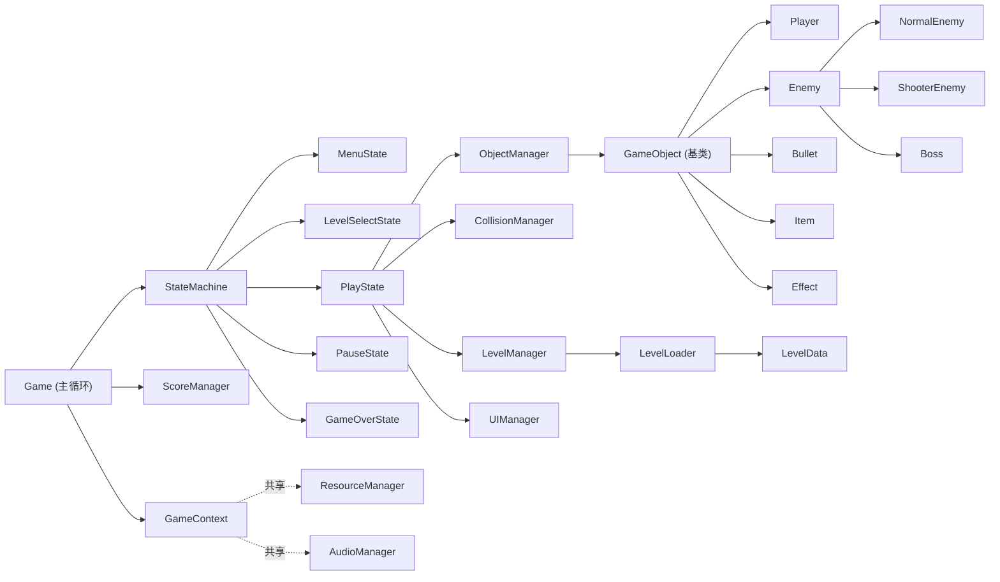

# Swifter — 弹幕飞机大战

A Danmaku Game that allows you to **parry** and **evade**!

基于 **SFML** 的 C++ 弹幕射击游戏。核心创新：类似《只狼》/《尼尔》的 **完美格挡** 与 **完美闪避** ——
当敌弹/敌机进入自机周围的“危险区间”时按对应键，触发无敌帧 + 变体攻击（及子弹时间）。

## 功能特性

- 图形化界面（SFML），键盘操作
- 类 Unity 生命周期帧刷新机制（`OnInit / OnUpdate / OnRender / OnDestroy`）
- 圆形判定碰撞、击中判定、道具掉落
- 关卡选择 + 从文本文件加载关卡（`assets/levels/*.txt`）
- BOSS 多阶段、专属血条、多种弹幕模式（环形/螺旋/扇形/瞄准/波浪）
- 敌机多样弹幕发射
- 音效播放（短音效 + BGM）
- 历史最高分持久化（`score.dat`，重启后自动加载）
- **创新**：完美格挡 / 完美闪避 + 无敌帧 + 变体攻击 + 子弹时间

## 操作

| 按键 | 功能 |
| --- | --- |
| 方向键 / WASD | 移动 |
| Z / 空格 | 开火 |
| X | 完美格挡（极限距离触发：弹反/摧毁敌弹） |
| Shift | 完美闪避（较大距离触发：无敌 + 子弹时间） |
| C | 炸弹（清屏） |
| Esc | 暂停 |

## 架构总览

游戏分为四层：

| 层 | 目录 | 职责 |
| --- | --- | --- |
| 底层引擎层 | `include/core/` | 基类、时间、输入、资源、数学、配置、上下文、主循环 |
| 管理控制层 | `include/managers/` | 对象/碰撞/关卡/分数/音频/UI 管理器 |
| 游戏对象层 | `include/objects/` | 自机、敌机、BOSS、子弹、道具、特效 |
| 数据层 | `include/data/` | 关卡数据结构与文件解析 |
| 状态机 | `include/game/` | 菜单/关卡选择/游玩/暂停/结算 |

### 类图关系



## 目录结构

```
Swifter/
├── CMakeLists.txt
├── README.md
├── include/
│   ├── core/            # 引擎层
│   │   ├── Game.h              # 主循环与顶层
│   │   ├── GameObject.h        # 生命周期基类
│   │   ├── GameContext.h       # 全局上下文
│   │   ├── Input.h             # 输入管理
│   │   ├── Time.h              # 时间/子弹时间
│   │   ├── ResourceManager.h   # 资源缓存
│   │   ├── Math.h / Random.h   # 工具
│   │   ├── Types.h             # 全局枚举
│   │   └── Config.h            # 常量配置
│   ├── managers/        # 管理层
│   │   ├── ObjectManager.h
│   │   ├── CollisionManager.h
│   │   ├── LevelManager.h
│   │   ├── ScoreManager.h
│   │   ├── AudioManager.h
│   │   └── UIManager.h
│   ├── objects/         # 对象层
│   │   ├── Player.h / Enemy.h / NormalEnemy.h / ShooterEnemy.h / Boss.h
│   │   ├── Bullet.h / Item.h / Effect.h
│   ├── data/            # 数据层
│   │   ├── LevelData.h / LevelLoader.h
│   └── game/            # 状态机
│       ├── GameState.h / StateMachine.h
│       ├── MenuState.h / LevelSelectState.h / PlayState.h
│       └── PauseState.h / GameOverState.h
├── src/
│   └── main.cpp
└── assets/
    ├── levels/          # 关卡文件
    │   ├── index.txt
    │   └── level1.txt ~ level3.txt
    ├── textures/  sounds/  fonts/
```

## 构建

```bash
mkdir build && cd build
cmake .. -DSFML_DIR="<SFML安装路径>/lib/cmake/SFML"
cmake --build . --config Release
```

> 当前仓库仅包含 **头文件框架**（头文件自洽，无具体实现）。各 `.cpp` 实现待按注释补全。

## 创新机制：完美格挡 / 完美闪避

自机周围有两个判定半径：

- `DODGE_WARNING_RADIUS`（较大，约 130px）：敌弹进入时按 **Shift** → 完美闪避
  - 获得 1.5s 无敌帧、5s 变体攻击、1.2s 子弹时间（敌弹减速）
- `PARRY_RADIUS`（更小，约 55px）：敌弹进入时按 **X** → 完美格挡
  - 弹反/摧毁该敌弹，获得 1.0s 无敌帧 + 5s 变体攻击

实现见 `Player::CheckPerfectActions` 与 `Player::FindClosestEnemyBullet`。
