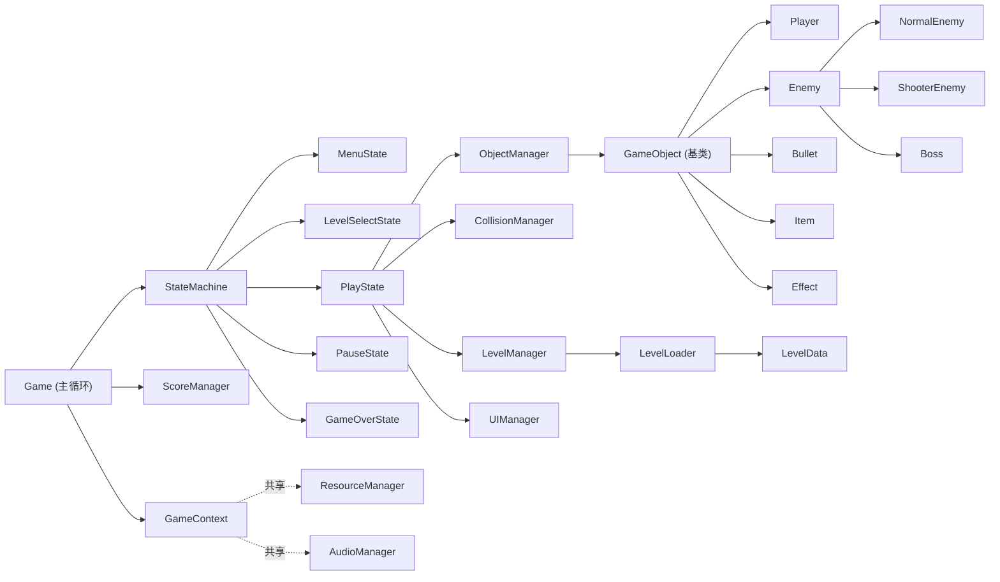

# Swifter

基于SFML的 C++ 弹幕射击游戏。加入了完美格挡与完美闪避的要素，当敌弹或敌机进入自机周围的一定区间时按对应键，可触发无敌帧变体攻击。

## 功能特性

- 图形化界面（SFML），键盘操作
- 类 Unity 生命周期帧刷新机制（`OnInit / OnUpdate / OnRender / OnDestroy`）
- 圆形判定碰撞、击中判定、道具掉落
- 关卡选择 + 从文本文件加载关卡（`assets/levels/*.txt`）
- BOSS 多阶段、专属血条、多种弹幕模式（环形/螺旋/扇形/瞄准/波浪）
- 历史最高分持久化
- 完美格挡 / 完美闪避

## 操作

| 按键 | 功能 |
| --- | --- |
| 方向键 / WASD | 移动 |
| Z / 空格 | 开火 |
| X | 完美格挡，仅在特定区间触发 |
| Shift | 闪避 |
| C | 炸弹 |
| Esc | 暂停 |

## 架构总览

游戏分为四层：

| 层 | 目录 | 职责 |
| --- | --- | --- |
| 底层引擎层 | `include/core/` | 基类、时间、输入、资源、数学、配置、上下文、主循环 |
| 管理控制层 | `include/managers/` | 对象/碰撞/关卡/分数/音频/UI 管理器 |
| 游戏对象层 | `include/objects/` | 自机、敌机、BOSS、子弹、道具、特效 |
| 数据层 | `include/data/` | 关卡数据结构与文件解析 |
| 状态机 | `include/game/` | 菜单/关卡选择/游玩/暂停/结算 |

### 类图关系

## 构建

使用CMake 4.4.0，SFML 3.1.0，MinGW 15.2.0于Windows